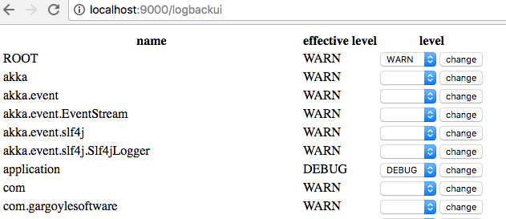

# play-logback-ui

Play logback UI



Add a following line to build.sbt:

```
libraryDependencies += "com.github.tkawachi" %% "play-logback-ui" % "0.0.1"
```

Add a following line to conf/routes:

```
-> /logbackui logbackui.Routes
```

`/logbackui` is just an example. Change it as you like.

`sbt run` and access [http://localhost:9000/logbackui](http://localhost:9000/logbackui)
